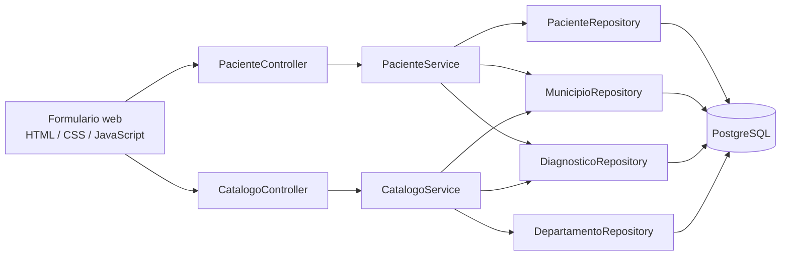
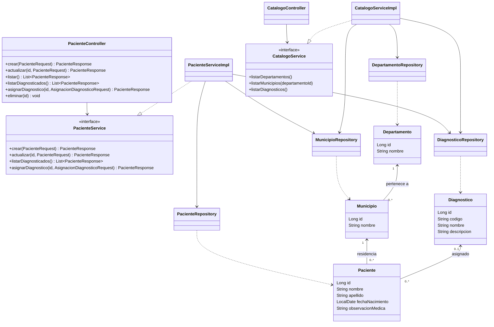
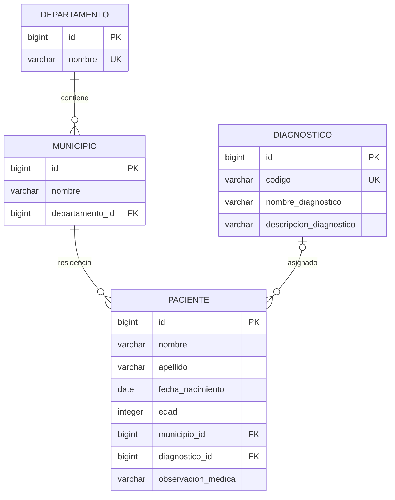

# Evaluación técnica y diagramas

## Matriz de cumplimiento de la prueba

| Punto | Solicitud | Estado inicial | Implementación |
|---|---|---|---|
| 1 | Crear, modificar, listar y borrar pacientes; nombre, apellido, nacimiento y municipio almacenado aparte | CRUD REST parcial. El municipio se aceptaba por nombre y podía crearse implícitamente; faltaba asociarlo con departamento. | CRUD REST completo y formulario web. Municipio y departamento son entidades separadas; el paciente guarda una FK a municipio. |
| 2 | Cada municipio pertenece a un departamento; no se requiere formulario para administrarlos | No existía entidad ni relación de departamento. | Catálogos persistidos y endpoints de consulta/alta para inicializarlos. Alta y edición cotidiana no requieren una pantalla especial; se incluye una sección opcional de configuración. |
| 3 | Tabla de diagnósticos con código interno y nombre | Había una entidad, pero su nombre empezaba en minúscula y el código se generaba automáticamente con otro formato. | Catálogo `Diagnostico` con código interno único proporcionado al crear el catálogo, nombre y descripción. |
| 4 | Asignar diagnóstico y observación médica escrita a cada paciente | Se creaba un diagnóstico nuevo cada vez, no se reutilizaba el catálogo y faltaba la observación. | La asignación selecciona un diagnóstico existente por código y guarda la observación asociada al paciente. |
| 5 | Mostrar abajo los diagnosticados con código, diagnóstico, observación, paciente, municipio y departamento | No existía vista de diagnosticados. | Tabla de seguimiento en la página principal y endpoint `/pacientes/diagnosticados` con todos los campos pedidos. |
| 6 | Diagrama de clases | No existía. | Diagrama Mermaid incluido abajo. |
| 7 | Modelo entidad-relación | No existía. | Diagrama ER Mermaid incluido abajo. |

### Requisitos generales de la hoja

- **Lenguaje:** la hoja exige PHP; este proyecto se conserva en Java, como pidió el autor. Es una diferencia formal frente al requisito, aunque la arquitectura y el comportamiento quedan implementados en Java.
- **Paradigma:** Java implementa el sistema con clases, entidades, servicios, repositorios y controladores.
- **Base de datos:** PostgreSQL se mantiene como base de ejecución; H2 se usa solo en pruebas.
- **Equipo y herramientas:** proyecto Maven con Java 17 y Spring Boot.
- **Interfaz:** se añadió un formulario web adaptable servido por Spring Boot en `/`; la hoja indica que la funcionalidad/arquitectura pesa más que el aspecto visual.

## Arquitectura

La interfaz web consume controladores REST. Los controladores reciben y responden DTOs, los servicios validan y aplican reglas del dominio y los repositorios acceden a PostgreSQL mediante Spring Data JPA. Las entidades son independientes de los DTOs para evitar aceptar relaciones arbitrarias desde el cliente y para devolver respuestas controladas.



## Diagrama de clases



## Modelo entidad-relación



Un diagnóstico es un registro reutilizable del catálogo; cada paciente puede tener cero o un diagnóstico asignado. La observación pertenece a la asignación del paciente, no al catálogo. Municipios con el mismo nombre pueden pertenecer a departamentos distintos en el modelo; el par departamento/nombre es único.

## API y uso

La página se sirve en `http://localhost:8080/`. Los catálogos se cargan antes de registrar pacientes. El formulario permite crear, editar y borrar pacientes, asociar diagnósticos con observaciones escritas y consultar al final la tabla de pacientes diagnosticados.

| Método | Ruta | Función |
|---|---|---|
| `GET`, `POST` | `/departamentos` | Consultar/crear departamentos |
| `GET`, `POST` | `/municipios` | Consultar municipios (filtro opcional `departamentoId`) y crear |
| `PUT` | `/municipios/{id}/departamento/{departamentoId}` | Asociar registros previos al departamento correcto |
| `GET`, `POST` | `/diagnosticos` | Consultar/crear el catálogo de diagnósticos |
| `POST` | `/pacientes` | Crear paciente; recibe `nombre`, `apellido`, `fechaNacimiento` (ISO `YYYY-MM-DD`) y `municipioId` |
| `GET` | `/pacientes`, `/pacientes/{id}` | Listar/consultar pacientes |
| `PUT`, `DELETE` | `/pacientes/{id}` | Actualizar/eliminar paciente |
| `POST` | `/pacientes/{id}/diagnostico` | Asignar `codigoDiagnostico` y `observacion` |
| `GET` | `/pacientes/diagnosticados` | Listar diagnosticados con los datos exigidos en el punto 5 |

Las solicitudes inválidas responden `400` y los recursos inexistentes `404`, con un mensaje JSON en `error`. Al actualizar datos demográficos se conserva el diagnóstico y su observación. La edad que permanece en el esquema legado se calcula desde la fecha de nacimiento; no se recibe del formulario.

## Actualización de una base de datos existente

La configuración local de PostgreSQL se conserva. Hibernate agrega las nuevas tablas/columnas con el `ddl-auto=update` ya configurado, pero no puede inferir a qué departamento pertenece cada municipio antiguo. La FK `municipios.departamento_id` se deja inicialmente nullable para que la actualización del esquema no destruya ni bloquee los datos actuales. Antes de volver a crear pacientes con dichos municipios:

1. Crear los departamentos con `POST /departamentos` o insertarlos en `departamentos`.
2. Vincular cada municipio existente mediante `PUT /municipios/{municipioId}/departamento/{departamentoId}`.
3. Una vez migrados todos los municipios, `departamento_id` puede declararse `NOT NULL` en la base de datos.

Los servicios ya impiden crear pacientes con municipios sin departamento. Hibernate `update` no elimina las restricciones `UNIQUE` heredadas de la relación uno-a-uno antigua entre paciente y diagnóstico; hay que localizar y retirar la que afecta a `pacientes.diagnostico_id`, de lo contrario varios pacientes no podrán compartir un diagnóstico del catálogo:

```sql
SELECT conname
FROM pg_constraint
WHERE conrelid = 'pacientes'::regclass
  AND contype = 'u'
  AND pg_get_constraintdef(oid) LIKE '%diagnostico_id%';
```

Después de revisar el nombre devuelto, eliminar esa restricción con `ALTER TABLE pacientes DROP CONSTRAINT nombre_obtenido;`. La antigua restricción global de unicidad de `municipios.nombre` puede retirarse de manera análoga si se requiere registrar topónimos iguales en departamentos distintos; el modelo nuevo hace único el par departamento/nombre. Se recomienda respaldar la base de datos antes de aplicar cambios de esquema.

## Pruebas

`mvnw test` ejecuta una prueba de integración HTTP contra una base H2 efímera. El test crea catálogos, registra un paciente, asigna diagnóstico y observación, revisa la lista requerida, actualiza y elimina al paciente; no requiere conectarse a PostgreSQL.
